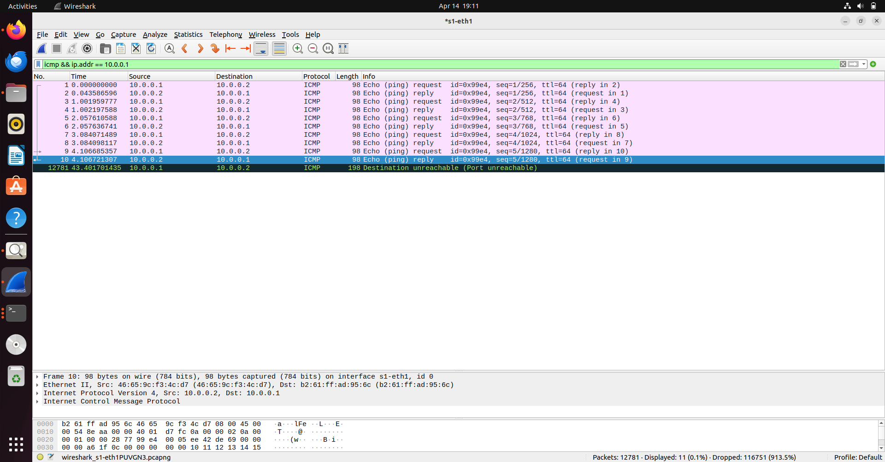
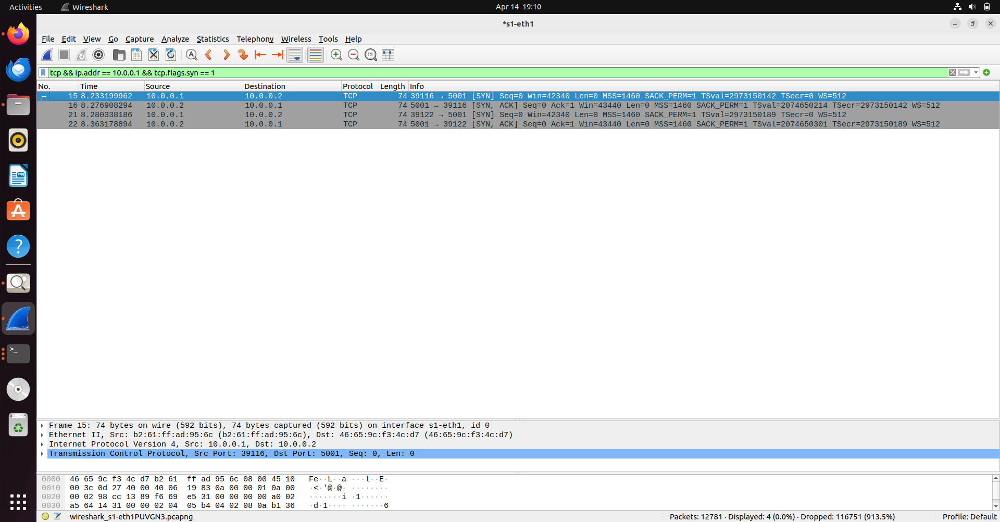
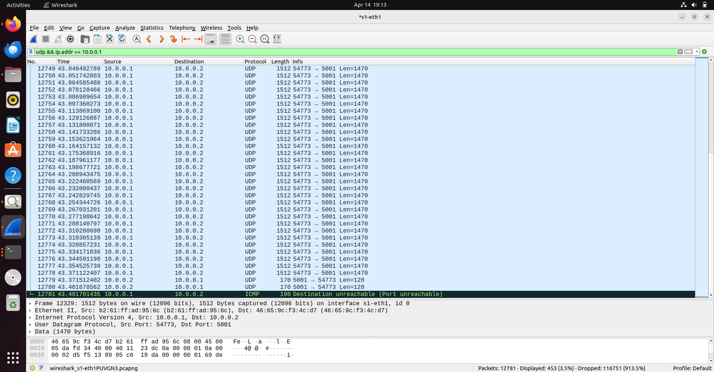
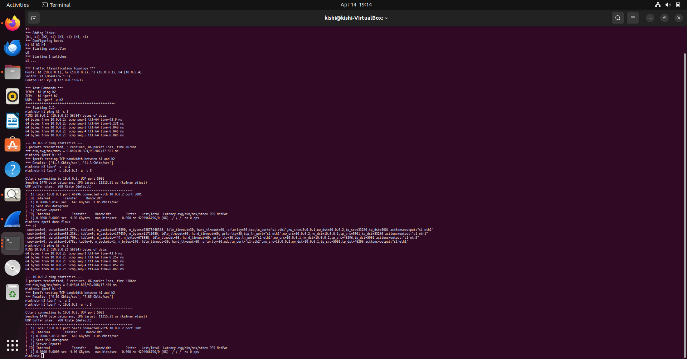
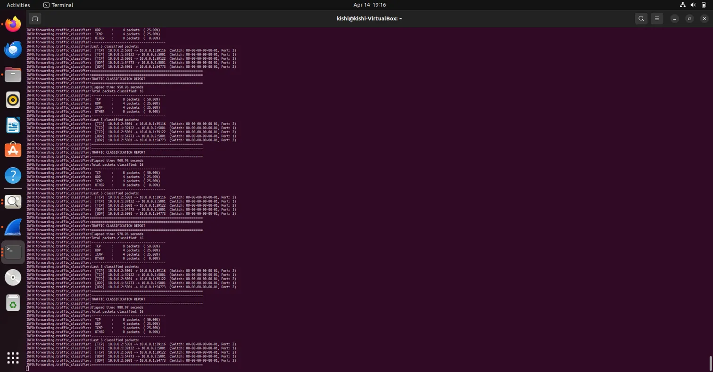

# SDN-Based Network Traffic Classification System

## Problem Statement

Design and implement an SDN-based Traffic Classification System using Mininet and an OpenFlow controller (POX) that:

- Identifies TCP, UDP, and ICMP packets
- Maintains traffic statistics
- Displays classification results in real-time
- Analyzes traffic distribution across protocol types

## Architecture

```
    +------+    +------+    +------+    +------+
    |  h1  |    |  h2  |    |  h3  |    |  h4  |
    |.0.1  |    |.0.2  |    |.0.3  |    |.0.4  |
    +--+---+    +--+---+    +--+---+    +--+---+
       |           |           |           |
       +-----------+-----------+-----------+
                       |
                  +----+----+
                  |   s1    |  (OpenFlow Switch)
                  +----+----+
                       |
                 +-----+-----+
                 |    POX    |
                 | Controller|
                 +-----------+
```

- **Hosts:** h1 (10.0.0.1), h2 (10.0.0.2), h3 (10.0.0.3), h4 (10.0.0.4)
- **Switch:** s1 (Open vSwitch, OpenFlow 1.0)
- **Controller:** POX Traffic Classifier @ 127.0.0.1:6633

## How It Works

1. The Mininet topology creates 4 hosts connected to a single OpenFlow switch.
2. The POX controller receives `packet_in` events whenever the switch encounters an unknown packet.
3. The controller inspects each packet and classifies it as TCP, UDP, ICMP, or OTHER.
4. Protocol-specific OpenFlow flow rules (match-action) are installed on the switch so subsequent similar packets are forwarded directly without controller involvement.
5. Traffic statistics are maintained and displayed every 10 seconds, showing packet counts and percentage distribution per protocol.

## Files

| File | Description |
|------|-------------|
| `traffic_classifier.py` | POX controller — handles packet classification, flow rule installation, and statistics |
| `topology.py` | Mininet custom topology — creates 4 hosts, 1 switch, connects to remote POX controller |
| `Screenshots/` | Proof of execution — Wireshark captures, terminal outputs |

## Prerequisites

- Ubuntu 22.04 (VM recommended)
- Mininet
- POX SDN Controller
- Wireshark
- iperf

### Installation

```bash
# Update system
sudo apt update && sudo apt upgrade -y

# Install Mininet, Wireshark, and iperf
sudo apt install -y mininet wireshark iperf

# Clone POX
cd ~ && git clone https://github.com/noxrepo/pox.git

# Copy the controller file into POX
cp traffic_classifier.py ~/pox/pox/forwarding/traffic_classifier.py
```

## How to Run

You need **two terminals** open.

### Terminal 1 — Start the POX Controller:

```bash
cd ~/pox && python3 pox.py log.level --DEBUG forwarding.traffic_classifier
```

### Terminal 2 — Start the Mininet Topology:

```bash
sudo python3 topology.py
```

## Test Scenarios

### Scenario 1: ICMP Traffic (Ping)

```bash
mininet> h1 ping h2 -c 5
```

Generates ICMP Echo Request/Reply packets between h1 and h2.

### Scenario 2: TCP Traffic (iperf)

```bash
mininet> iperf h1 h2
```

Generates TCP traffic for bandwidth testing between h1 and h2.

### Scenario 3: UDP Traffic (iperf)

```bash
mininet> h2 iperf -s -u &
mininet> h1 iperf -c 10.0.0.2 -u -t 5
```

Generates UDP datagrams from h1 to h2 for 5 seconds.

### View Flow Table

```bash
mininet> dpctl dump-flows
```

Displays installed OpenFlow flow rules on the switch, showing match-action entries for TCP, UDP, and ICMP traffic.

## Expected Output

The POX controller terminal displays a Traffic Classification Report every 10 seconds:

```
============================================================
TRAFFIC CLASSIFICATION REPORT
============================================================
Elapsed time: 250.09 seconds
Total packets classified: 16
----------------------------------------
  TCP      :     8 packets  ( 50.00%)
  UDP      :     4 packets  ( 25.00%)
  ICMP     :     4 packets  ( 25.00%)
  OTHER    :     0 packets  (  0.00%)
----------------------------------------
Last 5 classified packets:
  [TCP]  10.0.0.1:39122 -> 10.0.0.2:5001  (Switch: 00-00-00-00-00-01, Port: 1)
  [TCP]  10.0.0.2:5001 -> 10.0.0.1:39122  (Switch: 00-00-00-00-00-01, Port: 2)
  [UDP]  10.0.0.1:54773 -> 10.0.0.2:5001  (Switch: 00-00-00-00-00-01, Port: 1)
  [UDP]  10.0.0.2:5001 -> 10.0.0.1:54773  (Switch: 00-00-00-00-00-01, Port: 2)
============================================================
```

## Screenshots

### Wireshark — ICMP Capture


### Wireshark — TCP Capture


### Wireshark — UDP Capture


### Mininet Terminal — Test Results & Flow Table


### POX Controller — Traffic Classification Report


## Performance Observations

| Metric | ICMP (Ping) | TCP (iperf) | UDP (iperf) |
|--------|------------|-------------|-------------|
| Latency | ~0.04 - 98 ms (first packet higher due to controller) | N/A | N/A |
| Throughput | N/A | ~41-50 Gbits/sec | 1.05 Mbits/sec |
| Packet Loss | 0% | 0% | 0% |

- The first ICMP ping has higher latency (~93-98 ms) because the packet goes to the controller for classification and flow rule installation. Subsequent pings are much faster (~0.04 ms) as they match installed flow rules.
- TCP iperf achieves very high throughput since traffic flows directly through the switch after flow rules are installed.
- UDP iperf uses the default bandwidth of 1.05 Mbits/sec.

## References

- [Mininet Overview](https://mininet.org/overview/)
- [Mininet Walkthrough](https://mininet.org/walkthrough/)
- [POX SDN Controller](https://github.com/noxrepo/pox)
- [OpenFlow Specification](https://opennetworking.org/software-defined-standards/specifications/)
